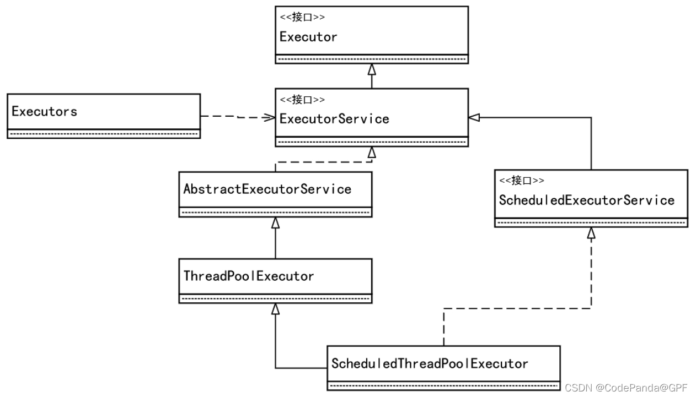

#### 1.线程池概念
   
创建Java线程需要给线程分配堆栈内存以及初始化内存，还需要进行系统调用，频繁地创建和销毁线程会大大降低系统的运行效率，采用线程池来管理线程有以下好处：

- 提升性能：线程池能独立负责线程的创建、维护和分配
- 线程管理：每个Java线程池会保持一些基本的线程统计信息，对线程进行有效管理

#### 2.JUC线程池架构



1. Executor
   Executor提供了execute()接口来执行已提交的Runnable执行目标实例,它只有1个方法：
   void execute(Runnable command)
2. ExecutorService
   继承于Executor,Java异步目标任务的“执行者服务接”口，对外提供异步任务的接收服务
```
     * param task the task to submit
     * @param <T> the type of the task's result
     * @return a Future representing pending completion of the task
     * @throws RejectedExecutionException if the task cannot be
     *         scheduled for execution
     * @throws NullPointerException if the task is null
     */
    <T> Future<T> submit(Callable<T> task);//向线程池提交单个异步任务

    //向线程池提交批量异步任务
    <T> List<Future<T>> invokeAll(Collection<? extends Callable<T>> tasks,
                                  long timeout, TimeUnit unit)
    throws InterruptedException;

```
3. AbstractExecutorService
      抽象类，实现了ExecutorService

4. ThreadPoolExecutor
   线程池实现类，继承于AbstractExecutorService，JUC线程池的核心实现类

5. ScheduledExecutorService
   继承于ExecutorService。它是一个可以完成“延时”和“周期性”任务的调度线程池接口

6. ScheduledThreadPoolExecutor
   继承于ThreadPoolExecutor，实现了ExecutorService中延时执行和周期执行等抽象方法

7. Executors
   静态工厂类，它通过静态工厂方法返回ExecutorService、ScheduledExecutorService等线程池示例对象

#### 3. Executors创建线程的4种方法

#### 4. 线程池的标准创建方式
```
public class ThreadPoolExecutor extends AbstractExecutorService {
/**
* Core pool size is the minimum number of workers to keep alive
* (and not allow to time out etc) unless allowCoreThreadTimeOut
* is set, in which case the minimum is zero.
*/
private volatile int corePoolSize;//核心线程数，即使线程空闲也不会被收回

	/**
     * Maximum pool size. Note that the actual maximum is internally
     * bounded by CAPACITY.
     */
    private volatile int maximumPoolSize;//线程的上限

	 /**
     * Timeout in nanoseconds for idle threads waiting for work.
     * Threads use this timeout when there are more than corePoolSize
     * present or if allowCoreThreadTimeOut. Otherwise they wait
     * forever for new work.
     */
    private volatile long keepAliveTime;//线程的最大空闲时长

/**
* The queue used for holding tasks and handing off to worker
* threads.  We do not require that workQueue.poll() returning
* null necessarily means that workQueue.isEmpty(), so rely
* solely on isEmpty to see if the queue is empty (which we must
* do for example when deciding whether to transition from
* SHUTDOWN to TIDYING).  This accommodates special-purpose
* queues such as DelayQueues for which poll() is allowed to
* return null even if it may later return non-null when delays
* expire.
*/
private final BlockingQueue<Runnable> workQueue;//任务的排队队列

 	private volatile ThreadFactory threadFactory;//新线程的产生方式
 	/**
     * Handler called when saturated or shutdown in execute.
     */
    private volatile RejectedExecutionHandler handler;//拒绝策略
}

```

1. 核心线程和最大线程数量

- corePoolSize用于设置核心（Core）线程池数量，参数maximumPoolSize用于设置最大线程数量
线程池接收到新任务，当前工作线程数少于corePoolSize, 即使有空闲的工作线程，也会创建新的线程来处理该请求，直到线程数达到corePoolSize
- 当前工作线程数多于corePoolSize数量，但小于maximumPoolSize数量，那么仅当任务排队队列已满时才会创建新线程
- maximumPoolSize被设置为无界值（如Integer.MAX_VALUE）时，线程池可以接收任意数量的并发任务

2. BlockingQueue

- BlockingQueue（阻塞队列）的实例用于暂时接收到的异步任务，如果线程池的核心线程都在忙，那么所接收到的目标任务缓存在阻塞队列中
3. keepAliveTime

- 空闲线程存活时间
- 用于设置池内线程最大Idle（空闲）时长（或者说保活时长）
- 超过这个时间，默认情况下Idle、非Core线程会被回收
注意：若调用了allowCoreThreadTimeOut(boolean)方法，并且传入了参数true，则keepAliveTime参数所设置的Idle超时策略也将被应用于核心线程

#### 5. 向线程池提交任务的两种方式

1. execute方法
- void execute(Runnable command): Executor接口中的方法
2. submit方法
- <T> Future<T> submit(Callable<T> task);
- <T> Future<T> submit(Runnable task, T result);
- Future<?> submit(Runnable task);

这3个submit方法都是ExecutorService接口中的方法

两种方法的区别：

- execute()方法只能接收Runnable类型的参数，而submit()方法可以接收Callable、Runnable两种类型的参数
- Callable类型的任务是可以返回执行结果的，而Runnable类型的任务不可以返回执行结果
- submit()提交任务后会有返回值，而execute()没有
- submit()方便Exception处理


